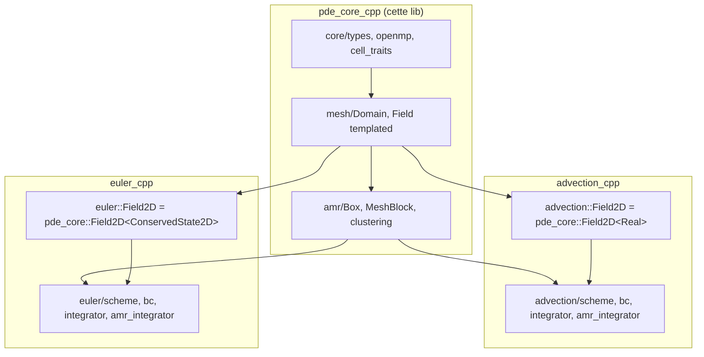

# Architecture

Ce document décrit la structure du code de `pde_core_cpp` et la manière
dont il s'intègre aux solveurs consommateurs. Pour le pseudocode des
algorithmes voir [`ALGORITHMS.md`](ALGORITHMS.md).

## 1. Position dans l'écosystème

`pde_core_cpp` est une bibliothèque purement infrastructure : aucune
équation, aucun schéma numérique, aucune condition aux limites
spécifique à un système conservatif. Tout ce qui dépendrait du type
d'état (Riemann solver, reconstruction, flux register payload,
intégrateur AMR) reste dans le solveur consommateur.



Les solveurs ne forkent pas `pde_core` ; ils le consomment via
`FetchContent` et alias les types dans leur propre namespace.

## 2. Layout du dépôt

```
pde_core_cpp/
├── CMakeLists.txt                              # cible INTERFACE pde_core::pde_core
├── README.md
├── LICENSE
├── .github/workflows/ci.yml                    # build + test ubuntu + macos
├── cmake/                                      # (vide pour l'instant, prêt pour FindXxx)
├── include/pde_core/
│   ├── core/
│   │   ├── types.hpp                           # Real, Index
│   │   ├── openmp.hpp                          # PDE_OMP_* + helpers
│   │   └── cell_traits.hpp                     # CellTraits<Cell>::zero() + accesseur composante + kahan_add
│   ├── mesh/
│   │   ├── domain1d.hpp                        # struct Domain1D
│   │   ├── domain2d.hpp                        # struct Domain2D
│   │   ├── field1d.hpp                         # template <Cell> class Field1D
│   │   └── field2d.hpp                         # template <Cell> class Field2D
│   ├── bc/
│   │   ├── periodic.hpp                        # PeriodicBC1D, apply<Cell>
│   │   ├── periodic_2d.hpp                     # PeriodicBC2D, corner pass
│   │   ├── outflow.hpp                         # OutflowBC1D
│   │   └── outflow_2d.hpp                      # OutflowBC2D
│   └── amr/
│       ├── box1d.hpp                           # struct Box1D
│       ├── box2d.hpp                           # struct Box2D
│       ├── mesh_block1d.hpp                    # template <Cell> class MeshBlock1D
│       ├── mesh_block2d.hpp                    # template <Cell> class MeshBlock2D
│       ├── mesh_hierarchy1d.hpp                # template <Cell> MeshHierarchy1D
│       ├── mesh_hierarchy2d.hpp                # template <Cell> MeshHierarchy2D, multi-niveau + multi-patch
│       ├── flux_register1d.hpp                 # template <Cell> FluxRegister1D, Kahan
│       ├── flux_register2d.hpp                 # template <Cell> FluxRegister2D, weighted + per-thread
│       ├── ghost_fill2d.hpp                    # fill_patch_ghosts_multipatch<Cell>
│       ├── regrid1d.hpp                        # regrid_1d<Cell, Criterion>
│       ├── regrid2d.hpp                        # regrid_2d / multilevel / multipatch
│       └── clustering2d.hpp                    # Berger-Rigoutsos 1991
└── tests/
    ├── CMakeLists.txt
    ├── test_field.cpp                          # Field<Real>, Field<FakeVecCell>, Domain
    ├── test_mesh_block.cpp                     # MeshBlock1D/2D + Box
    ├── test_mesh_hierarchy.cpp                 # MeshHierarchy avec multi-niveau, refinement, clear
    ├── test_bc.cpp                             # Periodic + Outflow sur Field<Real> et Field<FakeVec>
    ├── test_flux_register.cpp                  # FluxRegister scalaire et vec, weighted, per-thread merge
    ├── test_regrid.cpp                         # regrid_1d / 2d / multilevel / multipatch sur Real
    ├── test_ghost_fill.cpp                     # single-patch parent + sibling override
    └── test_clustering.cpp                     # Berger-Rigoutsos cas canoniques
```

La structure suit volontairement la convention `include/<libname>/`
pour que le path d'include soit `<pde_core/mesh/field2d.hpp>` plutôt
que `<field2d.hpp>` (évite les collisions avec d'éventuels headers
système du même nom et rend la dépendance explicite à la lecture).

## 3. Build et options CMake

```cmake
add_library(pde_core INTERFACE)
add_library(pde_core::pde_core ALIAS pde_core)

target_include_directories(pde_core INTERFACE
  $<BUILD_INTERFACE:${CMAKE_CURRENT_SOURCE_DIR}/include>
  $<INSTALL_INTERFACE:include>)

target_compile_features(pde_core INTERFACE cxx_std_20)

if(PDE_CORE_USE_OPENMP)
  find_package(OpenMP REQUIRED)
  target_link_libraries(pde_core INTERFACE OpenMP::OpenMP_CXX)
  target_compile_definitions(pde_core INTERFACE PDE_CORE_HAS_OPENMP)
endif()
```

Bibliothèque `INTERFACE` (header-only), pas d'objet à linker. Le
consommateur récupère les include paths et, si OpenMP est activé,
la dépendance `OpenMP::OpenMP_CXX` transitivement.

Options :

| Option | Défaut | Effet |
|---|---|---|
| `PDE_CORE_BUILD_TESTS` | `OFF` | Compile la suite Catch2 dans `tests/` |
| `PDE_CORE_USE_OPENMP` | `OFF` | Définit `PDE_CORE_HAS_OPENMP`, lie OpenMP transitivement |

Le define `PDE_CORE_USE_FLOAT` (à passer en `-D` côté compilateur) bascule
`Real = float` au lieu de `double`, à appliquer cohéremment dans le
solveur consommateur — non testé en CI pour l'instant.

## 4. Mécanisme d'intégration côté consommateur

### CMake

```cmake
include(FetchContent)
find_package(pde_core QUIET CONFIG)
if(NOT pde_core_FOUND)
  if(DEFINED PDE_CORE_SOURCE_DIR AND EXISTS "${PDE_CORE_SOURCE_DIR}")
    FetchContent_Declare(pde_core SOURCE_DIR "${PDE_CORE_SOURCE_DIR}")
  else()
    FetchContent_Declare(
      pde_core
      GIT_REPOSITORY https://github.com/wolf75222/pde_core_cpp.git
      GIT_TAG main
      GIT_SHALLOW TRUE)
  endif()
  FetchContent_MakeAvailable(pde_core)
endif()

target_link_libraries(my_solver INTERFACE pde_core::pde_core)
```

L'override `PDE_CORE_SOURCE_DIR` permet de pointer sur une checkout
locale pendant le développement (pas de network, pas de cache à
invalider à chaque push).

### Couche d'alias dans le solveur

Pour ne pas casser l'API publique du consommateur, chaque header
`pde_core/<x>.hpp` est ré-exporté par un thin wrapper local. Exemple
côté `euler_cpp` :

```cpp
// include/euler/mesh/field2d.hpp
#pragma once
#include <euler/core/types.hpp>            // pour ConservedState2D
#include <pde_core/mesh/field2d.hpp>

namespace euler {
using Field2D = pde_core::Field2D<ConservedState2D>;
}
```

L'utilisateur final continue d'écrire `euler::Field2D U(nx, ny, 2);`
sans rien changer. Côté `advection_cpp`, `ScalarField2D` est
`pde_core::Field2D<Real>`, idem.

## 5. Templating sur `Cell`

Le pivot conceptuel de la bibliothèque est `Field*D<Cell>`. Le choix de
templer plutôt que d'avoir une classe abstraite virtuelle est dicté
par trois considérations :

1. **Performance** : les méthodes `operator()(i, j)` sont appelées dans
   les hot loops à milliards d'opérations par seconde. Une dispatch
   virtuelle empêcherait l'inlining et coûterait facilement 2–3×.
2. **Types Eigen fixe-taille** : pour les `ConservedState2D` Euler
   (`Eigen::Matrix<Real, 4, 1>`), l'arithmétique vectorielle est
   inlinée par Eigen via expression templates. Une couche virtuelle
   casserait toute cette optimisation.
3. **Init automatique zero** : le trait `CellTraits<Cell>::zero()`
   spécialise via SFINAE sur la présence de `Cell::Zero()`. C'est
   ce qui rend `Field2D<ConservedState2D>(64, 64)` correctement
   zéro-initialisé sans que le consommateur déclare quoi que ce soit.

Le trade-off : la bibliothèque est header-only, donc chaque compilation
du consommateur paye le coût des templates. Pour 5 ou 10 instanciations
de `Field2D<Cell>`, c'est négligeable (les types sont petits) ; pour
des dizaines d'instanciations, on commencerait à voir le compile time
monter. C'est aujourd'hui sous le seuil.

## 6. Ce qui n'est pas dans `pde_core` et pourquoi

Pour comprendre où s'arrête la bibliothèque et pourquoi, voici les briques
qui restent **dans chaque solveur consommateur** :

| Brique | Pourquoi pas extraite ? |
|---|---|
| `amr_integrator*` (et ses variantes SSPRK3, MUSCL+SSPRK3, WENO5+SSPRK3) | Couple `MeshHierarchy`, `FluxRegister` (les deux extraits), mais aussi le schéma de flux du consommateur dont la signature `flux_x(eq, U, i, j)` n'est pas uniforme. Un refactor en politique de flux templée est faisable mais représente 1-2 semaines de travail prudent |
| Intégrateurs temps (`ExplicitEuler`, `SSP_RK2`, `SSP_RK3`, `Strang_split_2d`) | Appellent `scheme.rhs(...)` ou `scheme.step(...)` dont les signatures diffèrent par solveur. Extractibles avec un concept C++20 sur le schéma mais le gain (~200 lignes) est modeste face au risque |
| Conditions aux limites spécifiques (`Dirichlet`, `NoSlipWall`, `Sommerfeld`, `Reflective`) | `NoSlipWall` recompute la pression et l'énergie à partir de la mirror de la vitesse, ce qui est intrinsèquement Euler. `Sommerfeld` utilise les invariants de Riemann, idem. `Dirichlet` côté advection accepte une valeur scalaire arbitraire en inflow, sémantique différente |
| Solveurs Riemann, reconstructions WENO/MUSCL char-flux, viscous flux, sources (gravity, Lorentz, Hall) | Tous intrinsèquement Euler : manipulent `ConservedState2D`, font de l'algèbre de Roe ou de Jacobien, utilisent les variables caractéristiques |
| Schémas advection (`upwind`, `lax_friedrichs`, `lax_wendroff`, `godunov`, MUSCL rotating, WENO5 rotating) | Spécifiques au cas scalaire |

Tout ce qui est listé dans la section 2 du layout est **dans `pde_core`** :
mesh, BC géométriques, AMR primitives, hierarchy, flux register, ghost
fill, regrid (toutes les variantes), clustering. Le périmètre est
révisable si une duplication non prévue apparaît dans un solveur futur.

## 7. CI

GitHub Actions ([`.github/workflows/ci.yml`](../.github/workflows/ci.yml)) :
matrice `ubuntu-latest` + `macos-latest`, configure avec
`-DPDE_CORE_BUILD_TESTS=ON`, build header-only + 8 binaires de tests
(field, mesh_block, mesh_hierarchy, bc, clustering, flux_register, regrid,
ghost_fill),
exécute `ctest --output-on-failure`. Toute régression sur les traits
de cellule, l'indexation ghost, ou Berger-Rigoutsos est détectée à
chaque push.
